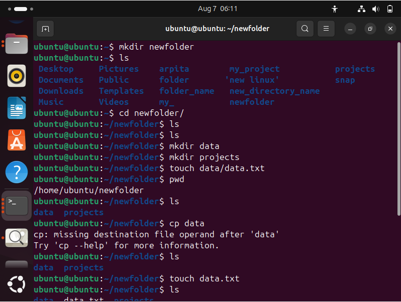

# FIRST LAB

---

### ✅ Contents of the Markdown file:

````markdown
# Linux File Commands Cheat Sheet
````
---
``

### 1. `rm` – Remove a File or Directory

- **Usage:**
  ```bash
  rm filename
````
````
* **Examples:**

  ```bash
  rm my_file.txt         # Delete a file
  rm -r my_folder/       # Delete a folder and its contents
  rm -f important.txt    # Force delete without prompt
  ```

---

## 2. `cp` – Copy Files or Directories

* **Usage:**

  ```bash
  cp source destination
  ```

* **Examples:**

  ```bash
  cp file.txt backup.txt           # Copy a file
  cp file.txt /home/user/docs/     # Copy file to another folder
  cp -r folder1/ folder2/          # Copy directories recursively
  ```

---

## 3. `touch` – Create an Empty File

* **Usage:**

  ```bash
  touch filename
  ```

* **Examples:**

  ```bash
  touch newfile.txt           # Create a new empty file
  touch a.txt b.txt c.txt     # Create multiple files at once
  ```

---

## 4. `mv` – Move (or Rename) a File

* **Usage:**

  ```bash
  mv source destination
  ```

### 🧪 Example: Move a File

```bash
# Step 1: Create a file
touch file1.txt

# Step 2: Create a folder
mkdir my_project

# Step 3: Move file1.txt into my_project/
mv file1.txt my_project/
```


