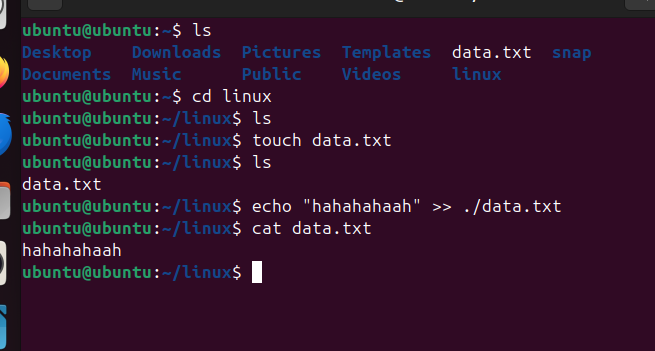

basic commands 
```bash 
$pwd
C:\Users\ACER\OneDrive\linux_lab
```
## 1. touch command - Create or Update Files
```` 
touch file1.txt 
````
## 2. echo command - Print Text or Write to File
```` 
echo "hahahahah" >> ./data.txt
````
## 3. cat – View and Concatenate Files 
```` 
cat data.txt
````
## 4. mv – Move or Rename Files
````
mv data.txt renamed_data1.txt
````
screetshot

