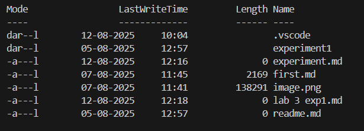

# LAB 3     

---

## ✅ 1. **Navigation Commands**

### `pwd` – Print Working Directory

Shows the current location in the filesystem.

```bash
pwd
```

📌 Output example:

```
/Users/yourname/projects
```

---

### `ls` – List Directory Contents

Lists files and folders in the current directory.

```bash
ls
```

* `ls -l` → Detailed list (permissions, size, date)
* `ls -a` → Shows hidden files (those starting with `.`)
* `ls -la` → Combined

---

### `cd` – Change Directory

Moves into a directory.

```bash
cd folder_name
```

Examples:

```bash
cd Documents        # Go to Documents
cd ..               # Go up one level
cd /                # Go to root
cd ~                # Go to home directory
```

---

## ✅ 2. **File and Directory Management**

### `mkdir` – Make Directory

Creates a new folder.

```bash
mkdir new_folder
```

---

### `touch` – Create File

Creates an empty file.

```bash
touch file.txt
```

---

### `cp` – Copy Files or Directories

```bash
cp source.txt destination.txt
```

* Copy folder:

```bash
cp -r folder1 folder2
```

---

### `mv` – Move or Rename Files

```bash
mv oldname.txt newname.txt
```

```bash
mv file.txt ~/Documents/     # Move file
```

---

### `rm` – Remove Files

```bash
rm file.txt          # Delete file
rm -r folder_name    # Delete folder (recursively)
```

---

## ✅ 3. **File Viewing & Editing**

### `cat` – View File Contents

Displays content in terminal.

```bash
cat file.txt
```

---

### `nano` – Edit Files in Terminal

A basic terminal-based text editor.

```bash
nano file.txt
```

* Use arrows to move
* `CTRL + O` to save
* `CTRL + X` to exit

---

### `clear` – Clears the Terminal

```bash
clear
```

Shortcut: `CTRL + L`

---

## ✅ 4. **System Commands**

### `echo` – Print Text

Useful for debugging or scripting.

```bash
echo "Hello, World!"
```

