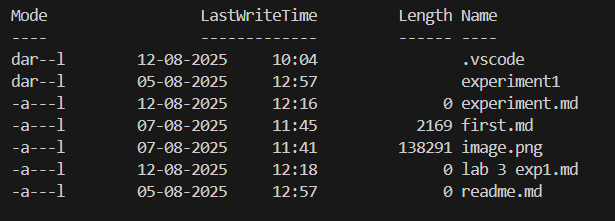

# basic linux command
```bash
$pwd
C:\Users\ACER\OneDrive\linux_lab
```
## 1. ls command
```` markdown
### ls command
the ls command in linux is used to list files and directories in the current directory (or a specified directory)
````
### image screen shot 


