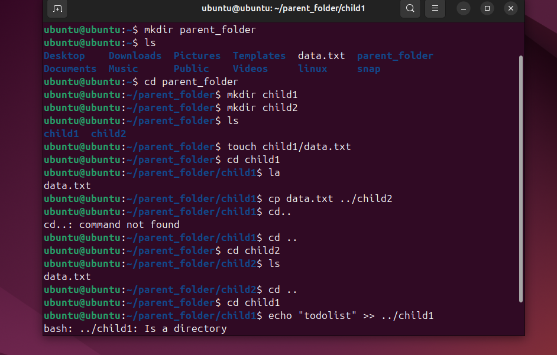
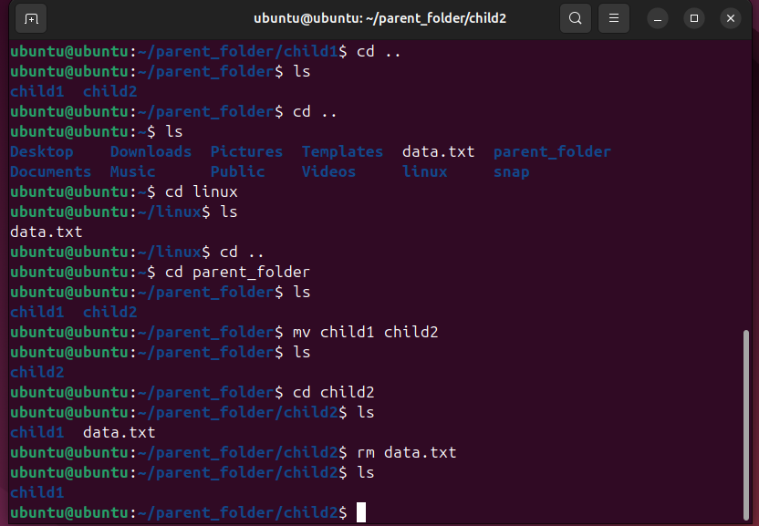

# basic commands lab 4

````markdown
# Basic Linux Commands: cp, echo, cat, mv, rm

This file explains commonly used Linux file commands with definitions and examples.

---

## 1. `cp` – Copy Files and Directories
**Definition:**  
The `cp` command is used to copy files or directories from one location to another.

**Examples:**
```bash
# Copy a file
cp file1.txt file2.txt

# Copy a file into another directory
cp file1.txt /home/user/Documents/

# Copy a directory recursively
cp -r folder1/ folder2/
````

---

## 2. `echo` – Display Text or Write to File

**Definition:**
The `echo` command displays a line of text in the terminal or writes it into a file.

**Examples:**

```bash
# Print text to terminal
echo "Hello, World!"

# Write text to a file (overwrite)
echo "This is a line of text" > file.txt

# Append text to a file
echo "Another line" >> file.txt
```

---

## 3. `cat` – View or Concatenate Files

**Definition:**
The `cat` command displays the contents of a file, combines multiple files, or creates new ones.

**Examples:**

```bash
# Display contents of a file
cat file.txt

# View multiple files together
cat file1.txt file2.txt

# Create a new file with cat
cat > newfile.txt
Hello World
(Press Ctrl+D to save and exit)
```

---

## 4. `mv` – Move or Rename Files

**Definition:**
The `mv` command is used to move files/directories or rename them.

**Examples:**

```bash
# Rename a file
mv oldname.txt newname.txt

# Move file to another directory
mv file.txt /home/user/Documents/

# Move multiple files at once
mv file1.txt file2.txt /home/user/Desktop/
```

---

## 5. `rm` – Remove Files and Directories

**Definition:**
The `rm` command removes files or directories permanently (cannot be undone easily).

**Examples:**

```bash
# Remove a file
rm file.txt

# Remove multiple files
rm file1.txt file2.txt

# Remove a directory recursively
rm -r foldername/

# Force remove without confirmation
rm -f file.txt
```

---

```

```





